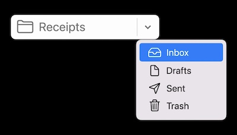
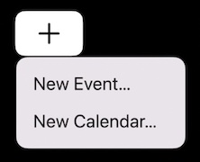

# DSFComboButton

<p align="center">
    
    
    
    <a href="https://swift.org/package-manager">
        
    </a>
</p>
<p align="center">

A drop-in `NSComboButton` replacement with pre macOS 13 support.

For when you want to adopt this control but have to maintain compatibility back to 10.13

## Features

### Split style



* Click on the leading side of the button to perform a 'default' action
* Click on the down arrow to present a menu

### Unified style



* Click on the button to perform a 'default' action
* Click and hold to present a menu

## Styles

| style      | description    |
|------------|----------------|
| `.split`   | A style that separates the button’s title and image from the menu indicator people use to activate the button. |
| `.unified` | A style that unifies the button’s title and image with the menu indicator. |

## Properties

| property       | type    | description                                          |
|----------------|---------|------------------------------------------------------|
| `style`        | `DSFComboButton.Style`  | The control style to use             |
| `title`        | `String`                | The text to display on the control   |
| `image`        | `NSImage`               | The image to display on the control  |
| `imageScaling` | `NSImageScaling`        | How the image scales                 |
| `target`       | `AnyObject`             | The target for the button's action   |
| `action`       | `Selector`              | The selector to call on the target   |
| `controlSize`  | `NSControl.ControlSize` | The size of the control              |

## Setting the popup menu

### via code

Assign an NSMenu instance to `.menu`

```swift
let button = DSFComboButton()
button.menu = NSMenu(...)
```

### via Interface Builder

1. Drop an `NSMenu` instance into your XIB/Storyboard
2. Ctrl-Drag from the `DSFComboButton` control on the storyboard to the menu, select `menu` outlet

## Setting the button's target/action

### via code

```swift
let button = DSFComboButton()
button.target = /*some controller*/
button.action = #selector(buttonPressed(_:))
```

### via Interface Builder

ctrl-drag from the `DSFComboButton` control to the code.

## License

```
MIT License

Copyright (c) 2022 Darren Ford

Permission is hereby granted, free of charge, to any person obtaining a copy
of this software and associated documentation files (the "Software"), to deal
in the Software without restriction, including without limitation the rights
to use, copy, modify, merge, publish, distribute, sublicense, and/or sell
copies of the Software, and to permit persons to whom the Software is
furnished to do so, subject to the following conditions:

The above copyright notice and this permission notice shall be included in all
copies or substantial portions of the Software.

THE SOFTWARE IS PROVIDED "AS IS", WITHOUT WARRANTY OF ANY KIND, EXPRESS OR
IMPLIED, INCLUDING BUT NOT LIMITED TO THE WARRANTIES OF MERCHANTABILITY,
FITNESS FOR A PARTICULAR PURPOSE AND NONINFRINGEMENT. IN NO EVENT SHALL THE
AUTHORS OR COPYRIGHT HOLDERS BE LIABLE FOR ANY CLAIM, DAMAGES OR OTHER
LIABILITY, WHETHER IN AN ACTION OF CONTRACT, TORT OR OTHERWISE, ARISING FROM,
OUT OF OR IN CONNECTION WITH THE SOFTWARE OR THE USE OR OTHER DEALINGS IN THE
SOFTWARE.
```
